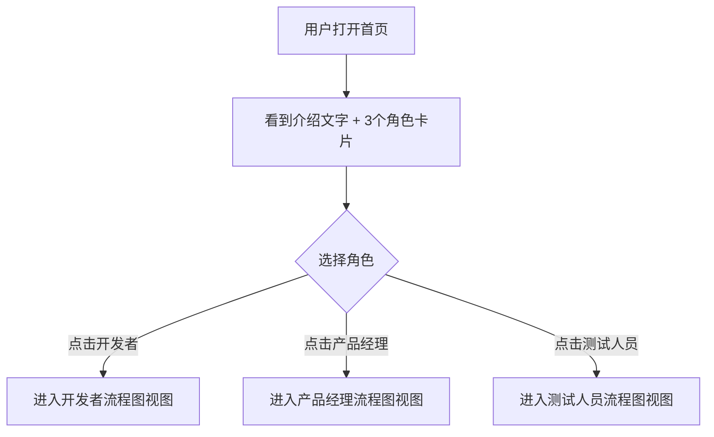
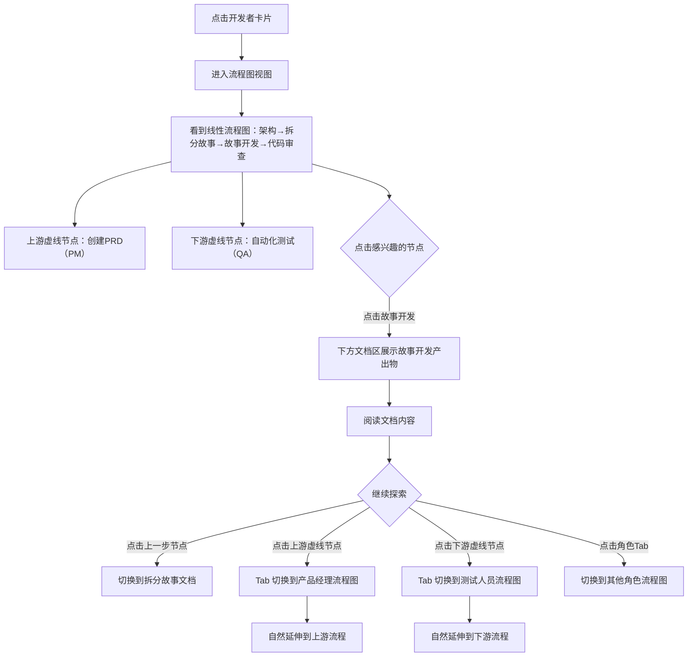
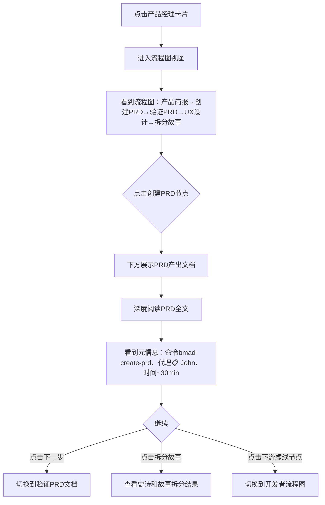
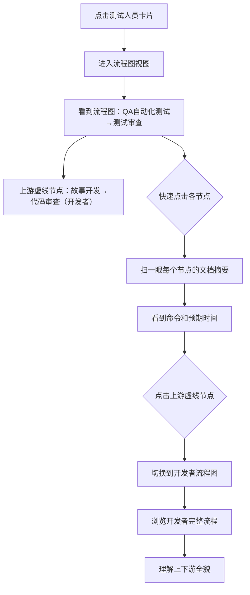

# UX Design Specification - BMAD Viewer

**Author:** Lu
**Date:** 2026-03-13

---

<!-- UX design content will be appended sequentially through collaborative workflow steps -->

## Executive Summary

### Project Vision

BMAD Viewer 是一个面向软件开发团队的只读 Web 应用，将 BMAD 方法的完整项目产出物以结构化方式展示，让团队成员通过浏览真实项目的全过程来学习人+AI 协作的工作模式。项目本身即用 BMAD 方法构建，形成"元学习闭环"。

### Target Users

所有用户均为软件开发团队成员，具备基本技术素养：
- **团队推动者（Lu）**：部署并推广，引导团队学习
- **开发者**：熟悉 AI 编程助手，需了解 AI 在上游环节的作用
- **产品经理**：需了解 AI 如何融入产品工作流
- **设计师/测试人员**：需了解 AI 在各自领域的应用场景

**用户特征：**
- 技术背景：全员软件开发相关，无需降低技术门槛
- 使用场景：桌面端深度阅读（30 分钟以上），不考虑移动端
- 界面偏好：无特定限制，以好用为准，开发者友好的 UI 模式可接受

### Key Design Challenges

1. **深度阅读舒适度**：连续阅读 30 分钟以上的长文档，需解决阅读疲劳、定位和导航问题（目录锚点、阅读进度感知）
2. **信息架构认知负担**：BMAD 工作流涉及多阶段、多代理角色、多命令，新用户首次接触易信息过载，需渐进式呈现
3. **文档间关联发现**：用户浏览文档时需自然地发现上下文关系（命令来源、下一步推荐），跨文档跳转需流畅

### Design Opportunities

1. **工作流即导航**：利用 BMAD 阶段的自然顺序作为信息架构，用户跟着工作流走就能理解全貌
2. **代理角色作为记忆锚点**：用 AI 代理角色的视觉标识（图标+名称）帮助用户快速定位上下文
3. **开发者友好的阅读体验**：面向开发者可大胆使用代码风格 UI 模式（等宽字体、语法高亮、侧边栏树状结构）

## Core User Experience

### Defining Experience

核心体验是"按角色找到与自己相关的工作流程"。用户不是来学习方法论理论的，而是来回答"我的工作怎么用 AI 做"这个问题。

**核心用户动作：** 选择自己的角色 → 看到相关工作流程段 → 点进具体环节查看真实产出物和对应的命令/代理角色。

**三个角色入口：**
- **开发者**：需求怎么变成故事 → 故事怎么开发 → 开发完怎么审查
- **产品经理**：客户需求怎么整理 → PRD 怎么写 → 怎么拆分成史诗和故事
- **测试人员**：开发完成后测试怎么做 → 自动化测试怎么生成 → QA 流程怎么跑

### Platform Strategy

- 桌面端 Web 应用（SPA），仅 Chrome
- 鼠标+键盘操作，不考虑触控和移动端
- 无需离线功能，内网 HTTP 访问
- 深度阅读场景优化（30 分钟以上持续使用）

### Effortless Interactions

1. **角色选择零思考**：首屏直接展示三个角色入口，用户一眼找到自己，一次点击进入
2. **流程上下文自然延伸**：开发者看完"故事开发"后，能自然发现上游的"需求是怎么来的"和下游的"测试怎么跑"，无需回到首页重新导航
3. **文档与命令映射就近呈现**：阅读文档时，对应的 BMAD 命令和代理角色就在旁边，不需要切换到另一个页面查找

### Critical Success Moments

1. **第一眼顿悟**：用户打开首页，看到三个角色入口，立刻知道"点这个就能看到跟我相关的内容"——3 秒内找到方向
2. **流程认知突破**：用户沿着自己角色的流程线浏览，发现"原来我上游/下游的同事是这样用 AI 的"——从了解自己的环节延伸到理解全流程
3. **行动转化时刻**：用户看到具体的命令和真实产出物，产生"我也可以试试"的冲动

### Experience Principles

1. **角色优先，方法论退后**：不以 BMAD 阶段为导航主线，而以用户角色为入口，让方法论服务于用户的关注点
2. **上下文连贯，自然延伸**：每个环节都能看到前因后果，用户可以沿着流程线自由探索上下游，不割裂
3. **真实产出即教材**：展示的是真实项目的真实产出物，不解释理论，让用户通过阅读真实案例自己理解
4. **深度阅读友好**：为 30 分钟以上的持续阅读优化排版、导航和视觉舒适度

## Desired Emotional Response

### Primary Emotional Goals

核心情感目标是**清晰和掌控感**——用户快速了解自己需要干什么、难度有多大。

- **清晰感**："我知道要做什么了"——流程步骤一目了然，不需要反复翻找
- **掌控感**："这个我能搞定"——每个环节的难度和工作量可预期，心里有数

### Emotional Journey Mapping

| 阶段 | 期望感受 | 设计支撑 |
|------|----------|----------|
| 首次打开 | "跟我有关的在这里" | 角色入口直达，3 秒找到方向 |
| 浏览流程 | "原来就这几步" | 流程步骤清晰列出，数量可见 |
| 查看具体环节 | "难度还行，我能做" | 每个环节标注难度和预期工作量 |
| 延伸上下游 | "上下游是这样衔接的" | 自然延伸，不割裂 |

### Micro-Emotions

**追求的：**
- 信心 > 困惑：每一步都清楚下一步是什么
- 务实 > 焦虑：难度透明，不会突然遇到"看不懂的东西"

**避免的：**
- 信息过载的压迫感："太多了看不完"
- 方法论的距离感："这跟我的日常工作有什么关系"
- 不确定的焦虑感："这到底难不难、要花多长时间"

### Design Implications

1. **难度可见** → 每个工作流环节标注难度等级（如简单/中等）和预期时间投入，让用户对工作量有预期
2. **结论前置** → 每个文档/环节先展示"做什么+产出什么"的摘要，再展开详细内容，用户可以选择深入或跳过
3. **步骤有限** → 流程展示要让用户看到"总共就这几步"，避免无限滚动的压迫感
4. **渐进揭示** → 先展示与用户角色直接相关的核心步骤，上下游内容作为可选延伸

### Emotional Design Principles

1. **务实优先**：不做情感渲染，不加多余装饰，每个 UI 元素都服务于"搞清楚要干什么"
2. **难度透明**：让用户在投入时间之前就知道每个环节的复杂度，消除不确定性
3. **信息克制**：宁可少展示也不要多展示，用户需要时再深入，避免首屏信息过载

## UX Pattern Analysis & Inspiration

### Inspiring Products Analysis

**Notion**
- 核心优势：干净的排版、清晰的信息层级、侧边栏+内容区的经典布局
- 导航模式：左侧树状侧边栏导航，右侧内容区沉浸式阅读，层级关系一目了然
- 阅读体验：大量留白、舒适的行间距、内容优先的视觉设计，适合长时间阅读
- 信息组织：页面嵌套页面的层级结构，面包屑导航保持位置感知
- 视觉风格：简洁、克制、功能性图标，不花哨但有辨识度

### Transferable UX Patterns

**导航模式：**
- **侧边栏树状导航** → 用于展示角色入口下的工作流步骤层级，用户可以折叠/展开查看不同深度
- **面包屑导航** → 用户深入某个文档后，始终知道自己在流程中的位置（角色 > 阶段 > 具体环节）

**阅读体验：**
- **大留白+舒适排版** → 直接借鉴 Notion 的内容区排版风格，优化 30 分钟以上的阅读体验
- **内容区全宽沉浸** → 阅读文档时内容区占据主要空间，减少视觉干扰

**信息呈现：**
- **块状内容结构** → 每个工作流环节作为一个"块"呈现，包含摘要、难度、命令、产出物等元信息
- **渐进展开** → 默认展示摘要，点击展开详细内容，控制信息密度

**交互模式：**
- **平滑过渡** → 侧边栏导航切换内容区时无需整页刷新，保持阅读连贯性

### Anti-Patterns to Avoid

1. **信息密度过高**：避免一屏塞满所有工作流步骤和文档，Notion 的克制值得学习
2. **导航层级过深**：BMAD Viewer 是只读浏览器，不需要 Notion 那样的无限嵌套，控制在 3 层以内（角色 > 阶段 > 文档）
3. **功能按钮过多**：Notion 有大量编辑功能按钮，BMAD Viewer 是只读的，界面要比 Notion 更简洁
4. **缺少上下文提示**：纯文档浏览器容易让用户"迷失在文档海中"，需要始终提供流程上下文（当前在哪一步、下一步是什么）

### Design Inspiration Strategy

**采用：**
- Notion 的侧边栏+内容区布局模式——经典、成熟、开发者熟悉
- Notion 的排版和留白风格——为深度阅读优化
- Notion 的面包屑位置感知——保持用户方向感

**适配：**
- 侧边栏以角色为顶层入口（而非 Notion 的页面列表），突出"跟我相关"的导航逻辑
- 文档元信息区增加 BMAD 特有信息：对应命令、代理角色、难度、预期时间
- 简化交互——去掉所有编辑功能，保留纯阅读+导航

**避免：**
- 不做 Notion 式的自由编辑能力——BMAD Viewer 是只读展示
- 不做无限嵌套——保持浅层级，降低认知负担

## Design System Foundation

### Design System Choice

**Tailwind CSS**（无组件库），纯 utility-first CSS 框架。

### Rationale for Selection

1. **视觉自由度最高**：BMAD Viewer 追求 Notion 式的简洁阅读体验，Tailwind 可以精确控制每个像素，不需要覆盖组件库的默认样式
2. **UI 复杂度低**：核心 UI 只有侧边栏、内容区、面包屑、文档渲染，不需要表单、弹窗、表格等复杂组件，不值得引入重量级组件库
3. **开发效率**：Tailwind 的 utility class 写法在简单 UI 场景下比组件库更快——直接写 class 即可，不需要查组件 API 文档
4. **包体积小**：仅 Chrome 内网部署，Tailwind purge 后 CSS 极小，配合 Go embed 打包无负担

### Implementation Approach

- Vue 3 + Tailwind CSS 4
- 自定义少量基础组件：侧边栏导航、面包屑、文档渲染容器、工作流卡片
- Markdown 渲染使用专用库（如 markdown-it），配合 Tailwind Typography 插件优化排版
- 所有样式通过 Tailwind utility classes 实现，不写自定义 CSS 文件

### Customization Strategy

- **排版**：使用 `@tailwindcss/typography` 插件，基于 Notion 风格调整 prose 样式（行间距、字号、颜色）
- **色彩**：定义极简色板——主色用于导航高亮和角色标识，其余以灰度为主，保持阅读舒适
- **间距**：大留白策略，内容区左右留出充足空间，避免文字贴边
- **组件复用**：通过 Vue 组件封装常用 UI 模式（如工作流卡片），而非 Tailwind 的 @apply 抽象

## Defining Core Interaction

### Defining Experience

**"选角色，看流程，读产出"**——用户选择自己的角色，看到一条线性流程图，每一步标注命令和预期时间，点进去读真实的产出文档。

用户向朋友描述时会说："打开网页，选你的角色，就能看到你的工作流程每一步怎么用 AI 做。"

### User Mental Model

**当前学习方式：** Lu 将文档发给团队成员，成员自行阅读学习。BMAD Viewer 是这个学习过程的可视化升级——从"读一堆文档"变成"看流程、按需读文档"。

**用户带来的心智模型：**
- 团队成员已有软件开发流程的基本认知（需求→开发→测试）
- 他们理解"流程图"这种表达方式，不需要学习
- 他们期望：点一个步骤就能看到这一步具体做了什么、产出了什么

**认知转变：** 从"AI 是写代码的工具"→"AI 是贯穿全流程的协作伙伴"。流程图让这个转变变得直观——用户看到的不只是自己的环节，还能看到上下游每一步都有 AI 参与。

### Success Criteria

用户完成浏览后能回答：
1. "我的工作流程有哪几步"——流程图一目了然
2. "每一步用什么命令"——每个节点标注对应的 BMAD 命令
3. "每一步大概花多少时间"——每个节点标注预期时间
4. "每一步产出什么"——点进去能看到真实的产出文档

**量化标准：**
- 用户在 30 秒内找到自己角色的流程图
- 用户在 5 分钟内浏览完自己角色的完整流程概览
- 用户能在流程图中自然延伸到上下游环节

### Novel UX Patterns

**模式分析：** 以成熟模式为主，无需用户学习新交互。

**采用的成熟模式：**
- **线性流程图**：用户天然理解的信息组织方式，无需说明
- **点击展开详情**：点击流程节点查看产出文档，符合直觉
- **侧边栏导航**：Notion 式经典布局，开发者熟悉

**BMAD Viewer 的独特之处：**
- 流程节点不只是流程名称，还附带命令、代理角色、时间、难度等元信息
- 流程图跨角色连通——开发者的流程自然连接到 PM 的上游和测试的下游

### Experience Mechanics

**1. 启动（Initiation）：**
- 用户打开首页，看到三个角色卡片（开发者 / 产品经理 / 测试人员）
- 每个卡片用一句话说明"你会看到什么"
- 用户点击自己的角色

**2. 交互（Interaction）：**
- 进入角色视图，左侧侧边栏展示该角色的流程步骤列表，右侧主区域展示线性流程图
- 流程图每个节点显示：步骤名称、BMAD 命令、代理角色图标、预期时间
- 用户点击流程节点，右侧内容区切换为该步骤的产出文档渲染
- 侧边栏当前步骤高亮，面包屑显示：角色 > 阶段 > 当前步骤

**3. 反馈（Feedback）：**
- 已浏览的流程节点视觉标记（如变灰或打勾），用户知道自己看了哪些
- 面包屑始终可见，用户不会迷失位置
- 流程图上下游节点可见但视觉弱化，暗示"你可以继续探索"

**4. 完成（Completion）：**
- 用户浏览完自己角色的所有步骤后，流程图显示完整状态
- 上下游延伸入口明确可见："查看上游（PM 如何产出需求）"或"查看下游（测试如何验收）"
- 用户可以随时回到角色选择页面切换视角

## Visual Design Foundation

### Color System

**主题：** 深色主题（Dark Theme）

**基础色：**
- 背景色：`#1a1a2e`（深蓝黑）——比纯黑更有层次感，长时间阅读不刺眼
- 表面色：`#16213e`（深蓝灰）——用于侧边栏、卡片等浮层
- 边框色：`#2a2a4a`（暗紫灰）——微妙的层级分隔
- 文字主色：`#e0e0e0`（浅灰白）——深色背景上的舒适阅读色
- 文字次色：`#a0a0b0`（灰色）——辅助信息、次要文字

**角色标识色（三色系）：**
- **开发者**：`#4fc3f7`（天蓝）——技术感、冷静、熟悉的"代码蓝"
- **产品经理**：`#81c784`（草绿）——成长、规划、产品生命力
- **测试人员**：`#b39ddb`（淡紫）——质量、严谨、与蓝绿形成互补

**语义色：**
- 成功/已完成：`#66bb6a`
- 警告/进行中：`#ffa726`
- 错误：`#ef5350`
- 链接/可交互：`#64b5f6`

**流程节点色：**
- 当前步骤：角色标识色（全亮度）
- 已浏览步骤：角色标识色（降至 40% 透明度）
- 未浏览步骤：`#404060`（暗灰）

### Typography System

**中文主字体：** `"PingFang SC", "Hiragino Sans GB", "Microsoft YaHei", sans-serif`
- 系统原生中文字体栈，无需加载外部字体，渲染清晰
- PingFang SC 在 macOS 上表现优秀，微软雅黑覆盖 Windows

**英文/代码字体：** `"JetBrains Mono", "Fira Code", monospace`
- 用于 BMAD 命令、代码片段等技术内容

**字号层级：**
- 页面标题（h1）：28px / 1.4 行高
- 章节标题（h2）：22px / 1.4 行高
- 小节标题（h3）：18px / 1.5 行高
- 正文：16px / 1.75 行高——深度阅读的舒适行高
- 辅助文字：14px / 1.5 行高——元信息、面包屑
- 标签/徽章：12px / 1.2 行高——难度标签、时间标签

### Spacing & Layout Foundation

**间距基数：** 8px

**间距规范：**
- 紧凑（xs）：4px——标签内边距
- 标准（sm）：8px——元素间小间距
- 舒适（md）：16px——卡片内边距、列表项间距
- 宽松（lg）：24px——区块间距
- 开阔（xl）：32px——页面区域间距
- 特大（2xl）：48px——主要内容区上下边距

**布局结构：**
- 侧边栏宽度：260px（固定）
- 内容区最大宽度：800px（居中，Notion 风格）
- 内容区左右内边距：48px
- 流程图区域：内容区全宽

**布局原则：**
1. 内容区居中且限宽，避免长行阅读疲劳（每行 60-80 个中文字符）
2. 大量留白，尤其是内容区与侧边栏之间
3. 流程图和文档内容共用同一内容区，通过视图切换而非分栏

### Accessibility Considerations

- 深色主题文字对比度 ≥ 4.5:1（`#e0e0e0` on `#1a1a2e` = 11.3:1）
- 角色标识色在深色背景上对比度均 ≥ 3:1
- 可交互元素有 hover/focus 状态变化
- 流程节点点击区域 ≥ 44px（触控友好，虽然不做移动端但不影响桌面体验）

## Design Direction Decision

### Design Directions Explored

通过 HTML 可视化展示对比了四种设计方向：
1. 经典侧边栏——Notion 式固定侧边栏 + 内容区
2. 流程图优先——流程图始终可见 + 下方文档面板
3. 卡片式仪表盘——角色卡片 + 步骤卡片网格
4. 极简阅读器——图标栏 + 可展开导航，最大化阅读面积

### Chosen Direction

**方向二：流程图优先**

核心布局：
- **上方区域**：角色 Tab 切换 + 线性流程图（始终可见）
- **下方区域**：点击流程节点后展示对应的产出文档

流程图节点包含：步骤名称、BMAD 命令、代理角色图标、预期时间。上下游节点以虚线弱化显示，暗示可延伸。

### Design Rationale

1. **流程全貌一目了然**：流程图始终可见，用户不需要在侧边栏和内容之间切换就能看到完整流程，直接回答"我的工作有哪几步"
2. **上下游自然可见**：线性流程图天然展示前后关系，上游（PM）和下游（QA）节点用虚线弱化显示，延伸探索零成本
3. **与核心体验完美匹配**：我们定义的核心体验是"选角色，看流程，读产出"——方向二的布局恰好是这个顺序：顶部选角色 → 中间看流程 → 下方读产出
4. **难度和时间信息直接在流程图上**：每个节点标注命令和时间，用户扫一眼流程图就能回答"每步要干什么、花多久"

### Implementation Approach

- 页面分为上下两个区域，上方固定高度（流程图区），下方弹性高度（文档区）
- 流程图使用 CSS Flexbox 布局，节点为 Vue 组件，支持点击交互和状态切换
- 角色切换通过顶部 Tab 组件实现，切换时流程图节点和文档内容同步更新
- 文档区内容居中限宽（800px），沿用 Notion 式排版风格
- 上下游节点使用虚线边框 + 低透明度，点击可跳转到对应角色的流程图

## User Journey Flows

### 首页 → 角色选择

用户打开首页，看到简短介绍文字和三个角色入口卡片。点击角色进入对应的流程图视图。

**首页内容：**
- 标题："BMAD Viewer"
- 介绍文字（1-2 句）："这是一个用 BMAD 方法从零构建的真实项目。选择你的角色，了解 AI 如何参与你的工作流程。"
- 三个角色卡片，每个包含：角色名称、角色图标（带角色色）、一句话说明、步骤数量和总预期时间

### 旅程二：开发者自由探索

**用户：** 开发者小王，从点击"开发者"卡片开始。

**关键交互细节：**
- 进入流程图视图后，默认不选中任何节点，流程图全貌可见
- 点击节点后，该节点高亮（角色色），下方文档区滑入显示
- 已点击过的节点变为半透明（标记已浏览）
- 点击上下游虚线节点时，自动切换角色 Tab 并定位到对应节点

### 旅程三：产品经理深度阅读

**用户：** 产品经理小李，从点击"产品经理"卡片开始。

**关键交互细节：**
- 小李会花较长时间阅读单个文档，文档区需要良好的滚动体验
- 流程图区域固定在顶部，阅读文档时始终可见当前位置
- 文档内的标题自动生成锚点目录（文档内导航）

### 旅程四：测试人员快速浏览

**用户：** 测试人员小赵，从点击"测试人员"卡片开始。

**关键交互细节：**
- 小赵是快速浏览模式，每个文档停留时间短
- 文档区摘要（做什么+产出什么）需要在首屏可见，无需滚动

### Journey Patterns

**跨旅程共享的交互模式：**

1. **角色入口模式**：首页 → 选择角色 → 进入流程图视图（所有旅程共享入口）
2. **流程图-文档联动模式**：点击流程节点 → 下方文档区更新 → 节点高亮（所有旅程核心交互）
3. **上下游延伸模式**：点击虚线节点 → 角色 Tab 自动切换 → 定位到对应节点（旅程二、三、四的延伸探索）
4. **已浏览标记模式**：点击过的节点视觉变化（降低透明度），用户知道哪些看过了

**导航层级：**
- 第一层：首页角色选择
- 第二层：角色流程图视图（含角色 Tab 切换）
- 第三层：节点文档详情（在同一页面下方展示）
- 全程无需页面跳转，所有交互在单页内完成

### Flow Optimization Principles

1. **零页面跳转**：所有交互在单页内完成（SPA），角色切换、节点点击、文档查看都不刷新页面
2. **首屏信息充足**：进入流程图视图后，用户不需要滚动就能看到完整流程图和节点元信息
3. **文档摘要前置**：点击节点后，文档区首先展示摘要（做什么+命令+时间+难度），用户可以选择是否继续阅读全文
4. **返回路径清晰**：流程图始终可见，用户随时可以点击其他节点或切换角色，不需要"返回"按钮

## Component Strategy

### Design System Components

Tailwind CSS 为 utility-first 框架，不提供现成 UI 组件。所有组件均为自建 Vue 组件，使用 Tailwind utility classes 实现样式。

### Custom Components

#### RoleCard — 角色卡片

**用途：** 首页角色入口，用户点击进入对应流程图视图
**内容：** 角色图标、角色名称、一句话说明、步骤数量、总预期时间
**状态：** 默认、hover（上浮 + 角色色边框发光）
**交互：** 点击跳转到流程图视图，传入角色参数

#### RoleTab — 角色 Tab

**用途：** 流程图视图顶部的角色切换
**内容：** 角色图标 + 角色名称
**状态：** 默认（灰色边框）、激活（角色色背景 + 边框）
**交互：** 点击切换流程图内容和文档区

#### FlowNode — 流程节点

**用途：** 流程图中的每个工作流步骤
**内容：** 步骤图标、步骤名称、BMAD 命令（等宽字体）、预期时间
**状态：**
- 默认：`var(--border)` 边框
- hover：角色色边框 + 上浮 2px
- 激活（当前选中）：角色色边框 + 角色色背景透明度 8%
- 已浏览：角色色边框 40% 透明度
- 上下游（其他角色）：虚线边框 + 整体 40% 透明度
**交互：** 点击切换下方文档区内容；点击上下游节点自动切换角色 Tab

#### FlowArrow — 流程箭头

**用途：** 连接流程节点，表示步骤顺序
**内容：** 箭头符号 `→`
**状态：** 角色色（当前角色流程内）、灰色（上下游连接）

#### DocMeta — 文档元信息

**用途：** 文档区顶部，展示当前步骤的元信息
**内容：** 代理角色徽章（图标+名称，角色色背景）、BMAD 命令（等宽字体代码样式）、预期时间徽章（警告色）、难度徽章（成功色）
**布局：** 水平排列，flex wrap

#### DocRenderer — 文档渲染器

**用途：** 渲染 Markdown 产出文档
**内容：** Markdown 转 HTML 后的富文本内容
**样式：** 基于 `@tailwindcss/typography` 的 prose 样式，深色主题适配
**特性：**
- 标题层级（h1-h3）使用定义的字号系统
- 代码块语法高亮（等宽字体 + 深色背景）
- 表格、列表、引用块的深色主题样式
- 无目录导航，纯内容滚动

### Component Implementation Strategy

**原则：**
- 每个组件一个 `.vue` 文件，使用 `<script setup>` + TypeScript
- 样式全部通过 Tailwind utility classes，不写 `<style>` 块
- 组件 props 定义清晰的类型接口
- 状态管理通过 Vue 响应式 API（ref/reactive），无需 Pinia（应用状态简单）

**数据流：**
- 角色和流程数据从后端 API 获取（解析 `bmad-help.csv`）
- 文档内容从后端 API 获取（读取 Markdown 文件）
- 当前角色、当前节点、已浏览节点列表作为页面级状态管理

### Implementation Roadmap

**MVP 全部组件（一次交付）：**

| 优先级 | 组件 | 依赖 |
|--------|------|------|
| 1 | DocRenderer | 无（核心渲染能力） |
| 2 | FlowNode + FlowArrow | 无（核心交互） |
| 3 | RoleTab | FlowNode（切换流程图） |
| 4 | DocMeta | 无（信息展示） |
| 5 | RoleCard | RoleTab（首页入口跳转到流程图视图） |

组件总数 6 个，UI 复杂度低，无需分阶段交付，MVP 一次性实现。

## UX Consistency Patterns

### Navigation Patterns

**角色切换：**
- 点击角色 Tab，流程图和文档区同步切换，无过渡动画，即时响应
- 当前角色 Tab 使用角色色背景高亮，其他 Tab 灰色

**节点选择：**
- 点击流程节点，该节点高亮，下方文档区更新内容
- 同一时间只有一个节点处于激活状态
- 再次点击同一节点不做操作

**上下游延伸：**
- 点击虚线节点，自动切换到对应角色 Tab 并激活该节点
- 切换后流程图滚动到该节点位置（如果超出可视区域）

**首页返回：**
- 流程图视图提供返回首页的入口（左上角 BMAD Viewer 标题可点击）

### State Patterns

**加载状态：**
- 数据请求时鼠标光标变为 `cursor: wait`，无其他加载指示
- 内网环境响应速度快，不做骨架屏或 loading 动画

**已浏览标记：**
- 点击过的流程节点降低至 40% 透明度（角色色）
- 已浏览状态存储在页面级状态中，刷新页面后重置（无需持久化）

**空状态：**
- 进入流程图视图但未选中任何节点时，文档区显示简短提示："点击上方流程节点查看详情"
- 文字居中，灰色，不喧宾夺主

**无文档状态：**
- 如果某个流程节点没有对应的产出文档，文档区显示："该步骤暂无产出文档"

### Interaction Feedback Patterns

**Hover 效果：**
- 流程节点：边框变为角色色 + 上浮 2px（`transform: translateY(-2px)`）
- 角色卡片（首页）：上浮 4px + 角色色边框发光（`box-shadow`）
- 角色 Tab：边框变为角色色
- 所有 hover 过渡时间：150ms ease

**点击反馈：**
- 流程节点：即时切换到激活状态（角色色边框 + 背景），无点击动画
- 角色 Tab：即时切换高亮，无动画

**文档区过渡：**
- 文档内容切换时无动画，直接替换内容
- 切换后文档区自动滚动到顶部

### Visual Consistency Rules

**圆角：**
- 卡片/节点：12px
- Tab/徽章：6px（小元素用小圆角）
- 代码块：4px

**阴影：**
- 仅在 hover 状态使用阴影（角色色 glow），默认状态无阴影
- 深色主题下阴影不明显，用边框色变化代替层级感

**过渡：**
- 所有交互过渡统一 150ms ease
- 不使用弹跳、回弹等花哨动画
